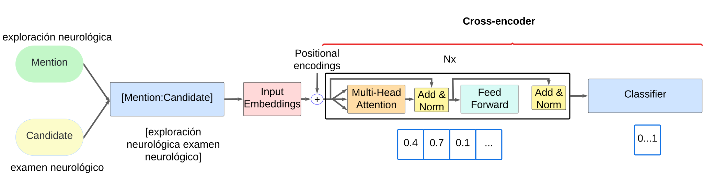

# Bidirectional Knowledge Graph Enhancement for Cross-Encoders

## Overview

This repository focuses on enhancing cross-encoder models by integrating knowledge graph insights. By utilizing `networkx` for graph-based operations and `SentenceTransformer` for encoding, this project aims to explore the impacts of unidirectional and bidirectional knowledge graph embeddings on the training process using hard triplets.

We compare these approaches against a baseline of hard triplets generated based on similarity scores ("sim") derived from bi-encoder candidate evaluations. The key idea is to study the effects of considering bidirectional relationships (i.e., both parent and child nodes in the graph) compared to a unidirectional approach (i.e., only parent nodes) and similarity-based hard triplets on the performance of cross-encoder models in various NLP tasks.

At the core, this project aims to shed light on how structured knowledge graphs can improve cross-encoder models' robustness and accuracy when tackling complex language understanding problems.



## Features

- **Knowledge Graph Construction**: Use `networkx` to construct and manipulate unidirectional and bidirectional knowledge graphs.
- **Cross-Encoder Training**: Leverage `SentenceTransformer` for developing robust cross-encoder models.
- **Triplet Mining**: Implement hard triplet mining techniques to improve model training efficiency and effectiveness, including KG, BKG, and similarity-based methods.
- **Bidirectional vs. Unidirectional Analysis**: Evaluate and compare the impacts of different graph structures and similarity-based triplets on model performance.

## Prerequisites

Before running this project, make sure to install the required dependencies. This project is built using Python 3.10+, and it is recommended to use a virtual environment to ensure consistency across different setups.

### Installation

1. Create a virtual environment (optional but recommended):
   ```bash
   python -m venv env
   source env/bin/activate  # For Linux/Mac
   # or
   .\env\Scripts\activate  # For Windows
   ```

2. Install the required dependencies using the provided `requirements.txt` file:
   ```bash
   pip install -r requirements.txt
   ```

Note: The environment setup is also provided in the `environment.yml` file for use with `conda`. Be aware that certain packages, like PyTorch (version 2.0.0 used here), might cause compatibility issues depending on your hardware and OS configuration. Please adjust the versions accordingly.

## Data Availability

Due to licensing restrictions of the UMLS dataset, data files are not provided in this repository. However, the datasets used in this project can be accessed via the following links:

- **DisTEMIST**:
   - Gazetteer: [DisTEMIST Gazetteer on Zenodo](https://zenodo.org/records/6505583)
   - Corpus: [DisTEMIST Corpus on Zenodo](https://zenodo.org/records/7614764)
- **MedProcNER**: [MedProcNER on Zenodo](https://zenodo.org/records/8224056)
- **SympTEMIST**: [SympTEMIST on Zenodo](https://zenodo.org/records/10635215)
- **UMLS (Metathesaurus)**: [UMLS Metathesaurus](https://www.nlm.nih.gov/research/umls/knowledge_sources/metathesaurus/index.html)

Please ensure to download and set up the data files in the correct paths before running the scripts. Modify the data paths in the provided scripts according to your local setup.

## Usage Examples

### Graph Generation

#### How to Run

The `graph_generation.py` script processes UMLS datasets to create knowledge graphs and save relevant dictionaries for further use. Here's how to run it:

```bash
python graph_generation.py --chunk_size 500000 --output_path "utils/"
```

#### Parameters

- `--path`: Specifies the path to the UMLS dataset directory.
- `--chunk_size`: Defines the number of records to process at a time (helps in managing memory usage).
- `--output_path`: The directory where the output files (graphs and dictionaries) will be saved.

### Cross-Encoder Training

#### How to Run

The `cross_encoder_training.py` script is used for training cross-encoder models using the hard triplets method derived from the knowledge graphs. Execute the script as follows:

```bash
python cross_encoder_training.py --model_mapping_file "utils/model_mapping.json" --corpus "MedProcNER" --batch_size 32 --epochs 1
```

#### Parameters

- `--model_mapping_file`: Path to the JSON file containing model mappings.
- `--corpus`: Name of the corpus to process, e.g., `MedProcNER`.
- `--batch_size`: Number of samples per batch.
- `--epochs`: Number of epochs to train the model.

## Advanced Settings

You can further customize the scripts with additional command-line arguments as described in the scripts' `argparse` setup. For detailed descriptions and more settings, refer to the parameter definitions in each script.
